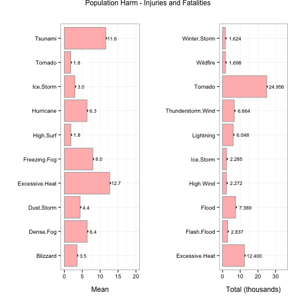
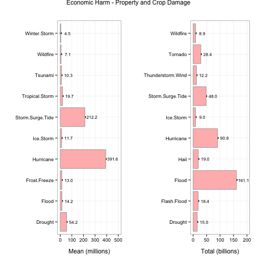

<link href="custom.css" rel="stylesheet">
 
####Storm Type and the Impact on Population Health and Economic Damages

<br>

----

####Synopsis

Storm data from the U.S. National Oceanic and Atmospheric Administration is analyzed to determine which storm types produce the largest impact on population health and economic damages. Population health is calculated using the mean number of recorded human fatalities and injuries associated with a storm event. Economic damage is calculated using the mean estimated property and crop damages for each event. The largest contributors are identified and their relative impact is determined.

<br>

----

####Data Processing

The version of the U.S. National Oceanic and Atmospheric Administration (NOAA) [storm database][1] used in this analysis is available for download from the Coursera Reproducible Research course website. The database covers the years 1950 through 2011. Later versions of the database are available at the NOAA National Climatic Data Center [storm events database][2] site.

The older source data used here has a number of format, data quality, and consistency issues that must be addressed before the data can be analyzed. The following data processing tasks are required:

1. Retrieve the raw data from the course website.
1. Uncompress the data and read it into memory.
1. Discard observations and variables not related to population health or economic damage.
1. Fix data quality issues with the order of magnitude indicators associated with economic damage estimates.
1. Convert economic damage estimates to numeric values.
1. Fix data quality and inconsistency issues with storm event type codes.
1. Map storm event type codes to NOAA standard values.
1. Extract the event year from the beginning date field.
1. Extract complete cases.

Each step is discussed in further detail, below.

<br>

#####Required libraries


```r
library(tools)
library(plyr)
library(ggplot2)
library(grid)
library(gridExtra)
```

<br>

#####Step 1: Retrieve the raw data from the course website.

The raw data is stored in a single bzip2 compressed file available from the Reproducible Research course website at Coursera.  To conserve processing time, the data set is only downloaded if it is not already present locally. All data sets used in this analysis are stored in a data subdirectory below the current working directory.  A log entry is made each time the file is downloaded. The log entry includes a timestamp, the md5 checksum of the compressed data file, and the URL from which the file was downloaded.

<br>


```r
##
##  Define the source data URL and file pathnames for the data subdirectory, the source
##  data file, and the log file.
##
f.url <- "https://d396qusza40orc.cloudfront.net/repdata%2Fdata%2FStormData.csv.bz2"
f.dir <- "./data"
f.dat <- paste0(f.dir,"/","StormData.csv.bz2")
f.log <- paste0(f.dir,"/","StormData.log"    )

##
##  If the data subdirectory does not alreay exist, create it.
##
if(!file.exists(f.dir)) {
    dir.create(f.dir)
}
    
##
##  If the data file is not already present locally, download the compressed file
##  from the specified URL. If the download fails, halt script execution and
##  issue an error message.
##
if (!file.exists(f.dat)) {
    if (download.file(url=f.url, destfile=f.dat, method="curl", quiet=TRUE)) {
        stop("Unable to download data file.")
    }
    
    ##
    ##  Append an entry to the log file specifying the time when the data
    ##  file was downloaded, the md5 checksum of the file, and the source
    ##  URL.
    ##
    log.entry <- data.frame(Sys.time(),md5sum(f.dat), f.url)
    write.table(log.entry, file=f.log, append=TRUE, row.names=FALSE, col.names=FALSE)
}
```

<br>

#####Step 2: Uncompress the data and read it into memory.

The source data is contained in a .csv file compressed with bzip2. It can be uncompressed and read with the read.csv() function in R. Due to the size of the file, the read process can take several minutes to complete. To reduce processing time, the source data is cached in the R object _raw.storm_.

<br>


```r
##
##  Uncompress and read the raw data file into memory. The read.csv() function
##  can uncompress bzip2 files. Record the number of observations and variables
##  in the raw data file. These values are subsequently displayed in the text of
##  this document.
##
raw.storm <- read.csv(f.dat, stringsAsFactors=FALSE)
raw.obs   <- nrow(raw.storm)
raw.var   <- ncol(raw.storm)
```

<br>

The raw source data set contains 902,297 observations of 37 variables.

<br>

#####Step 3: Discard observations and variables not related to population health or economic damage.

A large number of observations in the raw data set do not record either impacts on population health (fatalities and injuries) or economic damage (property damage or crop damage). To speed up processing, these non-relevant observations are discarded from the source data set.  Similarly, variables not required for the analysis are discarded. Variables that are retained for analysis include:

<br>

Variable    |  Description                                             |  Format / Units     
----------- | -------------------------------------------------------- | --------------------
BGN_DATE    |  Date that the storm event began.                        |  mm/dd/yyyy 0:00:00 
STATE       |  Two letter abbreviation for the US State or territory.  |  Character          
EVTYPE      |  Code specifying the storm event type.                   |  Character          
FATALITIES  |  Number of fatalities associated with the storm event.   |  Numeric            
INJURIES    |  Number of injuries associated with the storm event.     |  Numeric            
PROPDMG     |  Property damage estimate, base amount.                  |  Numeric            
PROPDMGEXP  |  Power of 10 to be applied to PROPDMG.                   |  "B", "M", "K", ""  
CROPDMG     |  Crop damage estimate, base amount.                      |  Numeric            
CROPDMGEXP  |  Power of 10 to be applied to CROPDMG.                   |  "B", "M", "K", ""   

Observations are kept if least one of the following fields contains a non-zero value:  PROPRDMG, CROPDMG, FATALITIES, or INJURIES.  Observations where all four fields are equal to zero are discarded.

To reduce processing time, the subsetted source data set is cached in the R object _src.storm_.

<br>


```r
##
##  Subset the raw data keeping only observations with non-zero property or crop damage
##  estimates or non-zero fatality or injury reports. Keep only the variables specified
##  in the table above. Record the number of remaining observations and variables. These
##  counts are reported in the text following this code chunk.
##
src.storm <- subset(raw.storm,
                    PROPDMG != 0 | CROPDMG != 0 | FATALITIES != 0 | INJURIES != 0,
                    select=c(BGN_DATE, STATE, EVTYPE, FATALITIES, INJURIES, PROPDMG, PROPDMGEXP, CROPDMG, CROPDMGEXP))
src.obs   <- nrow(src.storm)
src.var   <- ncol(src.storm)
```

<br>

The filtered source data set contains 254,633 observations of 9 variables.

<br>

#####Step 4: Fix data quality issues with order of magnitude indicators.

The economic consequences for a storm event are estimated for both property damage and crop damage. For each measurement, the data set includes two values: a base amount and an exponent character representing the order of magnitude to be applied to the base amount. Allowable exponent values are "" for no exponent, "K" for thousands, "M" for millions, and "B" for billions (as the term is used in the United States). As an example the pair (1.423,"M") represents 1,423,000. The pair (2.2,"B") represents 2,200,000,000. All amounts are USD.

Some damage amounts include other undefined characters in the exponent field--probably the result of data conversion errors. The following code determines the number of such entries in the data set and replaces any invalid exponent with NA so it can be excluded from further analysis.

<br>


```r
##
##  Construct a table of allowable exponent characters and their corresponding
##  scale factor. This table will be used in subsequent conversion calculations.
##
magnitudes          <- data.frame(c("B","M","K",""), c(10^9,10^6,10^3,10^0), stringsAsFactors=FALSE)
names(magnitudes)   <- c("tag","multiplier")

##
##  Count the number of property damage entries for each exponent character in the
##  data set. Determine the number of observations that contain unallowable values.
##  In the following code, 'prop' refers to property damage related fields. Variables
##  that include 'crop' refer to crop damage related fields. The counts will be displayed
##  in the text following this chunk.
##
prop.exp.tbl        <- ddply(src.storm, .(PROPDMGEXP), nrow)
names(prop.exp.tbl) <- c("tag","count")
bad.prop.exp.cnt    <- sum(prop.exp.tbl[!(prop.exp.tbl$tag %in% magnitudes$tag),"count"])

##
##  Count the number of crop damage entries for each exponent character in the
##  data set. Determine the number of observations that contain unallowable values.
##
crop.exp.tbl        <- ddply(src.storm, .(CROPDMGEXP), nrow)
names(crop.exp.tbl) <- c("tag","count")
bad.crop.exp.cnt    <- sum(crop.exp.tbl[!(crop.exp.tbl$tag %in% magnitudes$tag),"count"])

##
##  Create a list of invalid exponent codes in the property and crop damage
##  variables.  These will be used in subsequent steps to identify rows
##  to be ignored in the analysis.  They are also displayed in the text
##  following this chunk.
##
bad.prop.tags <- sort(setdiff(unique(src.storm$PROPDMGEXP),magnitudes$tag))
bad.crop.tags <- sort(setdiff(unique(src.storm$CROPDMGEXP),magnitudes$tag))

##
##  Replace invalid exponents with NA so they can subsequently be excluded
##  from processing.  Produce a map of all rows that include bad exponent
##  values and then use the replace() function to replace them with NA.
##
bad.prop.rows        <- src.storm$PROPDMGEXP %in% bad.prop.tags
src.storm$PROPDMGEXP <- replace(src.storm$PROPDMGEXP,bad.prop.rows,NA)
bad.crop.rows        <- src.storm$CROPDMGEXP %in% bad.crop.tags
src.storm$CROPDMGEXP <- replace(src.storm$CROPDMGEXP,bad.crop.rows,NA)
```

<br>

Out of a total of 254,633 retained observations, 260 have invalid property damage exponent codes. This represents 0.1021% of all observations. Given the low percentage, these observations have been dropped from the analysis.

For crop damage values, 45 have invalid exponent codes. This represents 0.0177% of all observations. Given the low percentage, these observations have also been dropped from the analysis.

Invalid exponent codes found in the property damage fields include:  {-, +, 0, 2, 3, 4, 5, 6, 7, h, H, m}. These were replaced with NA.

Invalid exponent codes found in the crop damage fields include:  {?, 0, k, m}. These were replaced with NA.

It is likely that the lower case values "m" and "k" refer to millions and thousands, however they do not comply with the [Storm Data Preparation Guidelines][3], so they have been discarded. Similarly, the codes "h" and "H" likely refer to hundreds, however these codes are also not defined in the NOAA procedures, so they have been discarded as well.

<br>

#####Step 5: Convert damage estimates to numeric values.

To simplify analysis, the damage values and exponents from the source data are expanded into a single numeric value for property damage and a single value for crop damage. These new fields, "prop.damage" and "crop.damage" are added to the source data.

<br>


```r
##
## Convert a base number and exponent tag to a single numeric value. If
## the exponent tag is NA, return NA for the total result. The calculation
## relies on the exponent map created in the previous chunk. This function
## is called from mapply() below.
##
computeDamage <- function(amt, exp) {
    if (is.na(exp)) {
        return(NA)
    } else {
        return(amt * magnitudes[magnitudes$tag==exp,"multiplier"])
    }
}

##
##  Iterate over each property and crop damage pair, using the computeDamage() function to convert each
##  base value and exponent to a single numeric value.  The resulting property and crop damage vectors
##  are added to the source data frame.
##
prop.damage <- mapply(function(amt,exp) computeDamage(amt,exp), src.storm$PROPDMG, src.storm$PROPDMGEXP)
crop.damage <- mapply(function(amt,exp) computeDamage(amt,exp), src.storm$CROPDMG, src.storm$CROPDMGEXP)
src.storm   <- cbind(src.storm, prop.damage, crop.damage)

##  UNIT TEST CODE:  Uncomment for testing purposes.
##  Display a random subset of results for verification
##
##row.nums    <- sort(sample(1:nrow(src.storm),size=30))
##src.storm[row.nums,c(6,7,8,9,10,11)]
```

<br>

#####Step 6: Fix data quality issues with storm event type codes.

The [Storm Data Preparation Guidelines][3] for the NOAA data set identify forty-eight storm event types. The raw source data, however, includes a large number of variations on these types as well as several invalid entries. Some raw values also include leading or trailing spaces and non-alphanumeric values. The source data event types have to be cleaned-up before they can be mapped to one of the NOAA values. Steps taken to clean-up the raw storm event types include:

1. Values are converted to all upper-case.
1. All leading and trailing spaces are removed.
1. All punctuation (non-alpha or non-numeric) characters are converted to a period.
1. All internal spaces are converted to a period.
1. Any series of multiple periods are converted to a single period.

After the raw event codes have been processed, a list of the remaining, unique values is saved in a local file.  Each entry in this file is then mapped to one of the forty-eight official NOAA storm event types.

<br>


```r
##
##  Some event type values are known to have leading and trailing spaces.
##  These will have to be removed to prior to the creation of factors.
##
trim <- function(s) {
    gsub("(^[[:space:]]+|[[:space:]]+$)", "", s)
}

##
##  Convert all raw event types to upper case and remove any leading or
##  trailing whitespace.  Replace any punctuation marks with a single
##  period.  Replace any remaining, internal whitespace with a single
##  period.  Replace any resulting runs of multiple periods with a
##  single period.
##
src.storm$EVTYPE   <- trim(toupper(src.storm$EVTYPE))
src.storm$EVTYPE   <- gsub("([[:punct:]]+)" , "." , src.storm$EVTYPE)
src.storm$EVTYPE   <- gsub("([[:space:]]+)" , "." , src.storm$EVTYPE)
src.storm$EVTYPE   <- gsub("([[:punct:]]+)" , "." , src.storm$EVTYPE)

##
##  Create a sorted list of the remaining, unique cleaned-up raw event types
##  and write it to the specified file.  A mapping table that maps these
##  remaining values to the official NOAA codes will be created offline
##  and will be used in the next processing step.
##
f.event.type       <- paste0(f.dir,"/","eventtype.csv")
unique.event.types <-sort(unique(src.storm$EVTYPE))
write.csv(unique.event.types,file=f.event.type,row.names=FALSE)
```

<br>

#####Step 7: Map storm event type codes to NOAA standard values.

The previous code produced a unique list of clean, raw EVTYPE values and wrote them to an external .csv file.  The values in this file were mapped to one of the forty-eight official NOAA storm event types based on the descriptions provided in the NOAA Storm Preparation Guidelines.  The mappings were saved to an external event mapping .csv file.  The code below uses this mapping file to append a new variable, _NOAA.Event_ to the source data set.

<br>


```r
##
##  Read the event mapping data file and translate the source event types
##  with the NOAA event types.
##
f.event.map <- paste0(f.dir,"/","eventmap.csv" )
event.map   <- read.csv(f.event.map)
src.storm   <- merge(src.storm, event.map, by.x="EVTYPE", by.y="Source.Event")
```

<br>

There are 425 distinct event types in the source data mapped to 45 NOAA event categories.

<br>

#####Step 8: Extract the event year from the beginning date field.

While the source data covers the years 1950 through 2011, the types of storm events recorded during those years is not consistent. To simplify time-based analysis of the data, the character string representing the event start time is converted to a POSIX time value and the year is extracted. A new variable, _begin.year_ is added to the data frame.

<br>


```r
##
##  Convert the BGN_DATE field to POSIX time and extract the year from the date.
##  Append the year to the source data.
##
begin.year  <- strptime(src.storm$BGN_DATE,format="%m/%d/%Y %H:%M:%S")$year + 1900
src.storm   <- cbind(src.storm, begin.year)

##
##  UNIT TEST CODE:  Uncomment for testing purposes.
##  Determine the first year that each NOAA event type occurred.  Display the
##  results for a sanity check.
##
##event.year  <- count(src.storm, c("NOAA.Event","begin.year"))
##first.year  <- ddply(event.year, .(NOAA.Event), summarize, first.appeared = min(begin.year), rm.na=TRUE)
##first.year
```

<br>

#####Step 9: Extract complete cases.

Remove all incomplete cases from the src data set.  This processing step will eliminate any records previously identified as having
an invalid damage exponent code, or whose raw storm event type could not be mapped to one of the forty-eight official NOAA storm event types.

<br>


```r
##
##  Identify all complete cases and create a new source data.frame containing
##  only those observations.  This new data frame will be used in the results
##  section.
##
cln.cases <- complete.cases(src.storm)
cln.storm <- src.storm[cln.cases,]
cln.obs   <- nrow(cln.storm)
```

<br>

An additional 345 observations were deleted.  This is the last processing step.

<br>

----

####Results

<br>

#####Storm event types most harmful with respect to population health

For purposes of this analysis, harm to population from an event is defined as the sum of all human fatalities and injuries reported for that single event.  To determine which event type is the most harmful with respect to population health, we consider the mean of all harm across like events.  We also consider the total harm caused by a particular storm event type.

In 1993, [National Weather Service Directive 10-1605][6] defined forty-five additional storm event types.  Prior to that year, only tornado (1950), thunderstorm wind (1955), and hail (1955) were recorded.  To ensure an accurate comparison, only data recorded between 1993 and 2011 were utilized in the following charts.

<br>


```r
##
##  Compute the total number of fatalities and injuries for each type of storm event for the years
##  1993-2011.  Also determine the mean number of fatalities and injuries for each storm event
##  type.
##
pop.1993      <- ddply(cln.storm[cln.storm$begin.year >= 1993,], .(NOAA.Event), summarize,
                       sum.fatalities = sum(FATALITIES),
                       sum.injuries   = sum(INJURIES  ),
                       sum.harm       = sum(FATALITIES, INJURIES),
                       mean.harm      = mean(FATALITIES + INJURIES))

##
##  Produce a top 10 list of the storm events which, on average, cause the most population
##  harm in the years 1993-2011.
##
pop.top.mean  <- pop.1993[order(-pop.1993$mean.harm),]
pop.top.mean  <- pop.top.mean[1:10,]

##
##  Produce a top 10 list of the storm events which, in total, cause the most population
##  harm in the years 1993-2011.
##
pop.top.sum   <- pop.1993[order(-pop.1993$sum.harm),]
pop.top.sum   <- pop.top.sum[1:10,]

##
##  UNIT TEST CODE:  Uncomment for testing purposes:
##  Display the top ten events by mean harm (1993-2011) and total
##  harm (1993-2011)
##
##pop.top.mean
##pop.top.sum

##
##  Create a single side-by-side plot showing the event types for the top 10 mean
##  and total population harm.
##
##  Create the mean plot.
##
pop.plot.mean <- qplot(NOAA.Event, mean.harm, data=pop.top.mean)
pop.plot.mean <- pop.plot.mean + geom_bar(stat="identity", fill="#FFBBBB", color="#AAAAAA")
pop.plot.mean <- pop.plot.mean + geom_text(aes(label=format(round(mean.harm,1), big.mark=",")), hjust=-0.15, size=3.0)
pop.plot.mean <- pop.plot.mean + ylim(0,20)
pop.plot.mean <- pop.plot.mean + xlab("")
pop.plot.mean <- pop.plot.mean + ylab("Mean")
pop.plot.mean <- pop.plot.mean + ggtitle("")
pop.plot.mean <- pop.plot.mean + theme_bw()
pop.plot.mean <- pop.plot.mean + theme(plot.title=element_text(vjust=1.2))
pop.plot.mean <- pop.plot.mean + theme(axis.title.x=element_text(vjust=-1, size=12, face="plain"))
pop.plot.mean <- pop.plot.mean + theme(axis.title.y=element_text(size=12))
pop.plot.mean <- pop.plot.mean + theme(plot.margin=unit(c(1,1,1,1),"lines"))
pop.plot.mean <- pop.plot.mean + coord_flip()

##
##  Create the sum plot.
##
pop.plot.sum  <- qplot(NOAA.Event, sum.harm/1000, data=pop.top.sum)
pop.plot.sum  <- pop.plot.sum  + geom_bar(stat="identity", fill="#FFBBBB", color="#AAAAAA")
pop.plot.sum  <- pop.plot.sum  + geom_text(aes(label=format(round(sum.harm/1000,3), big.mark=",")), hjust=-0.15, size=3.0)
pop.plot.sum  <- pop.plot.sum  + ylim(0,35)
pop.plot.sum  <- pop.plot.sum  + xlab("")
pop.plot.sum  <- pop.plot.sum  + ylab("Total (thousands)")
pop.plot.sum  <- pop.plot.sum  + ggtitle("")
pop.plot.sum  <- pop.plot.sum  + theme_bw()
pop.plot.sum  <- pop.plot.sum  + theme(plot.title=element_text(vjust=1.2))
pop.plot.sum  <- pop.plot.sum  + theme(axis.title.x=element_text(vjust=-1, size=12, face="plain"))
pop.plot.sum  <- pop.plot.sum  + theme(axis.title.y=element_text(size=12))
pop.plot.sum  <- pop.plot.sum  + theme(plot.margin=unit(c(1,1,1,1),"lines"))
pop.plot.sum  <- pop.plot.sum  + coord_flip()

##
##  Display a single figure with side-by-side plots.
##
grid.arrange(pop.plot.mean, pop.plot.sum, ncol=2, main="Population Harm - Injuries and Fatalities")
```

 

_Figure 1.  The mean number of injuries and fatalities, per event, for the ten most harmful storm event categories, contrasted with the total population harm by storm type (1993 to 2011)._

<br>

As can be seen, excessive heat events, on average, produce the highest number of injuries and fatalities on a per event basis.  They also caused the second greatest total number of injuries and fatalities recorded between 1993 and 2011.  A tsunami event similarly produced a large number of injuries and fatalities per occurrence, but due to their rarity, tsunamis do not contribute significantly to total population harm.  Tornados, while responsible overall for the greatest number of injuries and fatalities, generate significantly lower population harm on an individual basis.

<br>

#####Storm events most harmful with respect to economics

For purposes of this analysis, economic damage from an event is defined as the sum of all estimated property and crop damage reported for that event.  To determine which event type is the most harmful with respect to economic damage, we consider the mean of all damage across like events.  We also consider the total damage caused by a particular storm event type.

<br>


```r
##
##  Compute the total estimated property and crop damage for each storm event type
##  for the years 1993-2011.  Also determine the mean damages for each storm event
##  type.
##
eco.1993      <- ddply(cln.storm[cln.storm$begin.year >= 1993,], .(NOAA.Event), summarize,
                       sum.fatalities = sum(prop.damage),
                       sum.injuries   = sum(crop.damage  ),
                       sum.harm       = sum(prop.damage, crop.damage),
                       mean.harm      = mean(prop.damage + crop.damage))


##
##  Produce a top 10 list of the storm events which, on average, cause the most economic
##  damage in the years 1993-2011.
##
eco.top.mean  <- eco.1993[order(-eco.1993$mean.harm),]
eco.top.mean  <- eco.top.mean[1:10,]

##
##  Produce a top 10 list of the storm events which, in total, cause the most economic
##  damage in the years 1993-2011.
##
eco.top.sum   <- eco.1993[order(-eco.1993$sum.harm),]
eco.top.sum   <- eco.top.sum[1:10,]

##
##  UNIT TEST CODE:  Uncomment for testing purposes:
##  Display the top ten events by mean harm (1993-2011) and totale
##  harm(1993-2011).
##
##eco.top.mean
##eco.top.sum

##
##  Create a single side-by-side plot showing the event types for the top 10 mean
##  and total economic harm.
##
##  Create the mean plot.
##
eco.plot.mean <- qplot(NOAA.Event, mean.harm/1000000, data=eco.top.mean)
eco.plot.mean <- eco.plot.mean + geom_bar(stat="identity", fill="#FFBBBB", color="#AAAAAA")
eco.plot.mean <- eco.plot.mean + geom_text(aes(label=format(round(mean.harm/1000000,1), big.mark=",")), hjust=-0.15, size=3.0)
eco.plot.mean <- eco.plot.mean + ylim(0,500)
eco.plot.mean <- eco.plot.mean + xlab("")
eco.plot.mean <- eco.plot.mean + ylab("Mean (millions)")
eco.plot.mean <- eco.plot.mean + ggtitle("")
eco.plot.mean <- eco.plot.mean + theme_bw()
eco.plot.mean <- eco.plot.mean + theme(plot.title=element_text(vjust=1.2))
eco.plot.mean <- eco.plot.mean + theme(axis.title.x=element_text(vjust=-1, size=12, face="plain"))
eco.plot.mean <- eco.plot.mean + theme(axis.title.y=element_text(size=12))
eco.plot.mean <- eco.plot.mean + theme(plot.margin=unit(c(1,1,1,1),"lines"))
eco.plot.mean <- eco.plot.mean + coord_flip()

##
##  Create the sum plot.
##
eco.plot.sum  <- qplot(NOAA.Event, sum.harm/1000000000, data=eco.top.sum)
eco.plot.sum  <- eco.plot.sum  + geom_bar(stat="identity", fill="#FFBBBB", color="#AAAAAA")
eco.plot.sum  <- eco.plot.sum  + geom_text(aes(label=format(round(sum.harm/1000000000,1), big.mark=",")), hjust=-0.15, size=3.0)
eco.plot.sum  <- eco.plot.sum  + ylim(0,200)
eco.plot.sum  <- eco.plot.sum  + xlab("")
eco.plot.sum  <- eco.plot.sum  + ylab("Total (billions)")
eco.plot.sum  <- eco.plot.sum  + ggtitle("")
eco.plot.sum  <- eco.plot.sum  + theme_bw()
eco.plot.sum  <- eco.plot.sum  + theme(plot.title=element_text(vjust=1.2))
eco.plot.sum  <- eco.plot.sum  + theme(axis.title.x=element_text(vjust=-1, size=12, face="plain"))
eco.plot.sum  <- eco.plot.sum  + theme(axis.title.y=element_text(size=12))
eco.plot.sum  <- eco.plot.sum  + theme(plot.margin=unit(c(1,1,1,1),"lines"))
eco.plot.sum  <- eco.plot.sum  + coord_flip()

##
##  Display a single figure with side-by-side plots.
##
grid.arrange(eco.plot.mean, eco.plot.sum, ncol=2, main="Economic Harm - Property and Crop Damage")
```

 

_Figure 2.  The mean amount of estimated property and crop damage, per event, for the ten most harmful storm event categories, contrasted with  total economic harm by storm type (1993 to 2011)._

<br>

As can be seen, hurricanes and storm surge tides, on average, create the largest economic damage on a per event basis.  Floods, due to their higher frequency, account for the overall maximum estimated damage recorded between 1993 and 2011.  As with population harm, tsunamis have significant economic impact, but due to their rarity, do not contribute significantly to overall economic damage.

<br>

<br>

[1]: https://d396qusza40orc.cloudfront.net/repdata%2Fdata%2FStormData.csv.bz2 "Storm Data"
[2]: http://www.ncdc.noaa.gov/stormevents/ "National Climatic Data Center Storm Events Database"
[3]: https://d396qusza40orc.cloudfront.net/repdata%2Fpeer2_doc%2Fpd01016005curr.pdf "Storm Data Documentation"
[4]: https://d396qusza40orc.cloudfront.net/repdata%2Fpeer2_doc%2FNCDC%20Storm%20Events-FAQ%20Page.pdf "FAQ"
[5]: http://rpubs.com/ "RPubs.com"
[6]: http://www.ncdc.noaa.gov/stormevents/pd01016005curr.pdf
