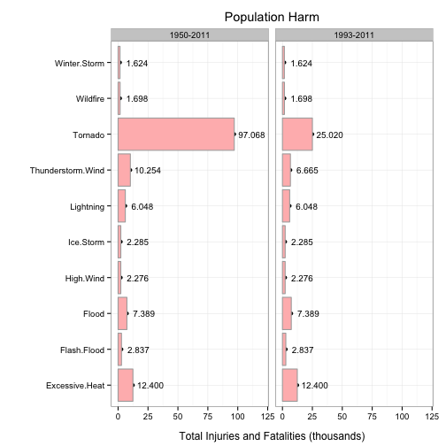
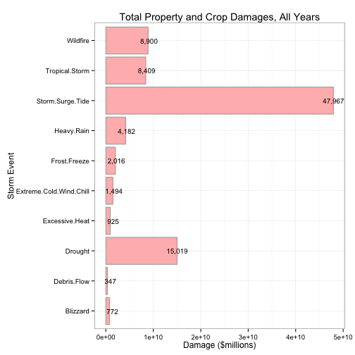

<link href="custom.css" rel="stylesheet">
 
####Storm Type and the Impact on Population Health and Economic Damages

<br>

----

####Synopsis

<br>

----

####Data Processing

The version of the U.S. National Oceanic and Atmospheric Administration (NOAA) [storm database][1] used in this analysis is available for download from the Coursera Reproducible Research course website. The database covers the years 1950 through 2011. Later versions of the database are available at the NOAA National Climatic Data Center [storm events database][2] site.

The older source data used here has a number of format, data quality, and consistency issues that must be addressed before the data can be analyzed. The following data processing tasks are required:

1. Retrieve the raw data from the course website.
1. Decompress the data and read it into memory.
1. Discard observations and variables not related to population health or economic damage.
1. Fix data quality issues with order of magnitude indicators.
1. Convert damage estimates to numeric values.
1. Fix data quality issues with storm event type codes.
1. Map storm event type codes to NOAA standard values.
1. Extract the event year.

Each step is discussed in further detail, below.

<br>

#####Required libraries


```r
library(tools)
library(plyr)
library(ggplot2)
library(grid)
```

<br>

#####Step 1: Retrieve the raw data from the course website.

The raw data is stored in a single bzip2 compressed file available from the Reproducible Research course website at Coursera.  To conserve processing time, the data set is only downloaded if it is not already present locally. All data sets used in this analysis are stored in a data subdirectory.  This subdirectory is created, if it does not already exist. To recognize changes, a log entry is made each time the file is downloaded. The log entry includes a timestamp, the md5 checksum of the compressed data file, and the URL from which the file was downloaded.

<br>


```r
##
##  Define the URL and file pathnames for the data subdirectory, the source data
##  file, and the log file.
##
f.url <- "https://d396qusza40orc.cloudfront.net/repdata%2Fdata%2FStormData.csv.bz2"
f.dir <- "./data"
f.dat <- paste0(f.dir,"/","StormData.csv.bz2")
f.log <- paste0(f.dir,"/","StormData.log"    )

##
##  If the data subdirectory does not alreay exist, create it.
##
if(!file.exists(f.dir)) {
    dir.create(f.dir)
}
    
##
##  If the data file is not already present locally, download the compressed file
##  from the specified URL.  If the download fails, halt program execution and
##  issue an error message.
##
if (!file.exists(f.dat)) {
    if (download.file(url=f.url, destfile=f.dat, method="curl", quiet=TRUE)) {
        stop("Unable to download data file.")
    }
    
    ##
    ##  Append an entry to the log file specifying the time when the data
    ##  file was downloaded, the md5 checksum of the file, and the source
    ##  URL.
    ##
    log.entry <- data.frame(Sys.time(),md5sum(f.dat), f.url)
    write.table(log.entry, file=f.log, append=TRUE, row.names=FALSE, col.names=FALSE)
}
```

<br>

#####Step 2: Decompress the data and read it into memory.

The source data is contained in a .csv file compressed with bzip2. It can be decompressed and read with the read.csv() function in R. Due to the size of the file, the read process can take several minutes to complete. To reduce processing time, the source data is cached in the R object `raw.storm`.

<br>


```r
##
##  Uncompress and read the raw data file into memory.  The read.csv() function
##  can uncompress bzip2 files.  Record the number of observations and variables
##  in the raw data file.  These values are reported in the text of this document.
##
raw.storm <- read.csv(f.dat, stringsAsFactors=FALSE)
raw.obs   <- nrow(raw.storm)
raw.var   <- ncol(raw.storm)
```

<br>

The raw source data set contains 902,297 observations of 37 variables.

<br>

#####Step 3: Discard observations and variables not related to population health or economic damage.

A large number of observations in the raw data set do not record either impacts on population health (fatalities and injuries) or economic damage (property damage or crop damage).  To speed up processing, these non-relevent observations are discarded from the source data set.  Similarly, variables not required for the analysis are discarded.  Variables that are retained for analysis include:

<br>

Variable    |  Description                                             |  Format / Units     
----------- | -------------------------------------------------------- | --------------------
BGN_DATE    |  Date that the storm event began.                        |  mm/dd/yyyy 0:00:00 
STATE       |  Two letter abbreviation for the US State or territory.  |  Character          
EVTYPE      |  Code specifying the storm event type.                   |  Character          
FATALITIES  |  Number of fatalities associated with the storm event.   |  Numeric            
INJURIES    |  Number of injuries associated with the storm event.     |  Numeric            
PROPDMG     |  Property damage estimate, base amount.                  |  Numeric            
PROPDMGEXP  |  Power of 10 to be applied to PROPDMG.                   |  "B", "M", "K", ""  
CROPDMG     |  Crop damage estimate, base amount.                      |  Numeric            
CROPDMGEXP  |  Power of 10 to be applied to CROPDMG.                   |  "B", "M", "K", ""   

To reduce processing time, the subsetted source data set is cached in the R object `src.storm`.

<br>


```r
##
##  Subset the raw data keeping only observations with non-zero property or crop damage
##  estimates or non-zero fatality or injury reports.  Keep only the variables specified
##  in the table above.  Record the number of remaining observations and variables.  These
##  values are reported in the text of this document.
##
src.storm <- subset(raw.storm,
                    PROPDMG != 0 | CROPDMG != 0 | FATALITIES != 0 | INJURIES != 0,
                    select=c(BGN_DATE, STATE, EVTYPE, FATALITIES, INJURIES, PROPDMG, PROPDMGEXP, CROPDMG, CROPDMGEXP))
src.obs   <- nrow(src.storm)
src.var   <- ncol(src.storm)
```

<br>

The filtered source data set contains 254,633 observations of 9 variables.

<br>

#####Step 4: Fix data quality issues with order of magnitude indicators.

The economic consequences for a storm event are estimated for both property damage and crop damage. For each measurement, the data set records two values: a base amount and an exponent character representing the order of magnitude to be applied to the base amount. Allowable exponent values are "" for no exponent, K" for thousands, "M" for millions, and "B" for billions (as the term is used in the United States). As an example the pair (1.423,"M") represents 1,423,000.  The pair (2.2,"B") represents 2,200,000,000.  All amounts are USD.

Some damage amounts include other undefined characters in the exponent field--probably the result of data conversion errors. The following code determines the number of such entries in the data set and replaces any invalid exponent with NA so it can be excluded from further analysis.

<br>


```r
##
##  Construct a table of allowable exponent characters and their corresponding
##  scale factor.  This table will be used in subsequent conversion calculations.
##
magnitudes          <- data.frame(c("B","M","K",""), c(10^9,10^6,10^3,10^0), stringsAsFactors=FALSE)
names(magnitudes)   <- c("tag","multiplier")

##
##  Count the number of property damage entries for each exponent character in the
##  data set.  Determine the number of observations that contain unallowable values.
##  In the following code, 'prop' refers to property damage related fields.  Variables
##  that include 'crop' refer to crop damage related fields.
##
prop.exp.tbl        <- ddply(src.storm, .(PROPDMGEXP), nrow)
names(prop.exp.tbl) <- c("tag","count")
bad.prop.exp.cnt    <- sum(prop.exp.tbl[!(prop.exp.tbl$tag %in% magnitudes$tag),"count"])

##
##  Count the number of crop damage entries for each exponent character in the
##  data set.  Determine the number of observations that contain unallowable values.
##
crop.exp.tbl        <- ddply(src.storm, .(CROPDMGEXP), nrow)
names(crop.exp.tbl) <- c("tag","count")
bad.crop.exp.cnt    <- sum(crop.exp.tbl[!(crop.exp.tbl$tag %in% magnitudes$tag),"count"])

##
##  Create a list of invalid exponent codes in the property and crop damage
##  variables.  These will be used in subsequent steps to identify rows
##  to be ignored in the analysis.
##
bad.prop.tags <- sort(setdiff(unique(src.storm$PROPDMGEXP),magnitudes$tag))
bad.crop.tags <- sort(setdiff(unique(src.storm$CROPDMGEXP),magnitudes$tag))

##
##  Replace invalid exponents with NA so they can subsequentally be excluded
##  from processing.  Produce a map of all rows that include bad exponent
##  values and then use the replace() function to replace them with NA.
##
bad.prop.rows        <- src.storm$PROPDMGEXP %in% bad.prop.tags
src.storm$PROPDMGEXP <- replace(src.storm$PROPDMGEXP,bad.prop.rows,NA)
bad.crop.rows        <- src.storm$CROPDMGEXP %in% bad.crop.tags
src.storm$CROPDMGEXP <- replace(src.storm$CROPDMGEXP,bad.crop.rows,NA)
```

<br>

Out of a total of 254,633 retained observations, 260 have invalid property damage exponent codes. This represents 0.1021% of all observations. Given the low percentage, these observations have been dropped from the analysis.

For crop damage values, 45 have invalid exponent codes. This represents 0.0177% of all observations. Given the low percentage, these observations have also been dropped from the analysis.

Invalid exponent codes found in the property damage fields include:  {-, +, 0, 2, 3, 4, 5, 6, 7, h, H, m}.  These were replaced with NA.

Invalid exponent codes found in the crop damage fields include:  {?, 0, k, m}.  These were replaced with NA.

It is likely that the lower case values "m" and "k" refer to millions and thousands, however they do not comply with the [Storm Data Preparation Guidelines][3], so they have been discarded.  Similarly, the codes "h" and "H" likely refer to hundreds, however these codes are also not defined in the NOAA procedures, so they have been discarded as well.

<br>

#####Step 5: Convert damage estimates to numeric values.

To simplify analysis, the damage values and exponents from the source data are expanded into a single numeric value for property damage and for crop damage.  These new fields, "prop.damage" and "crop.damage" are added to the source data.

<br>


```r
##
## Compute the damage value given the base amount and the exponent tag.
## If the tag is NA, then return NA for the result.
##
computeDamage <- function(amt, exp) {
    if (is.na(exp)) {
        return(NA)
    } else {
        return(amt * magnitudes[magnitudes$tag==exp,"multiplier"])
    }
}

prop.damage <- apply(src.storm[,c("PROPDMG","PROPDMGEXP")], 1, function(x) computeDamage(as.numeric(x[1]),x[2]))
crop.damage <- apply(src.storm[,c("CROPDMG","CROPDMGEXP")], 1, function(x) computeDamage(as.numeric(x[1]),x[2]))
src.storm   <- cbind(src.storm, prop.damage, crop.damage)
##
##  Display a subset of results for verification
##
row.nums    <- sort(sample(1:nrow(src.storm),size=30))
src.storm[row.nums,c(6,7,8,9,10,11)]
```

```
##        PROPDMG PROPDMGEXP CROPDMG CROPDMGEXP prop.damage crop.damage
## 17013     25.0          K       0                  25000           0
## 46098      2.5          K       0                   2500           0
## 64122      0.0                  0                      0           0
## 78125     25.0          K       0                  25000           0
## 139327     2.5          M       0                2500000           0
## 191863     5.0          K       0                   5000           0
## 196881    50.0       <NA>       0                     NA           0
## 268140    50.0          K       5          K       50000        5000
## 297366     2.0          K       0                   2000           0
## 320146    10.0          K       0                  10000           0
## 332455     2.0          K       0                   2000           0
## 334836     5.0          K       0                   5000           0
## 344146    10.0          K       0                  10000           0
## 346817     0.0                  0                      0           0
## 500350    12.0          K       0                  12000           0
## 502304     5.0          K       0                   5000           0
## 565310    20.0          K      15          K       20000       15000
## 566510     3.0          M       0                3000000           0
## 643506   500.0          K       0                 500000           0
## 644143     5.0          K       0                   5000           0
## 704602    15.0          K       0          K       15000           0
## 771330     2.0          K       0          K        2000           0
## 781130     1.0          K       0          K        1000           0
## 781742   125.0          K       0          K      125000           0
## 787239     1.0          K       0          K        1000           0
## 801768     2.2          K       0          K        2200           0
## 824667     0.0          K       0          K           0           0
## 840676   150.0          K       0          K      150000           0
## 843032     5.0          K       0          K        5000           0
## 876887     3.0          K       0          K        3000           0
```

<br>

#####Step 6: Fix data quality issues with storm event type codes.

The [Storm Data Preparation Guidelins][3] for the NOAA data set identify forty-eight storm event types. The source data, however, includes a large number of variations on these types as well as other invalid data.  The source data event types have to be cleaned-up and mapped to one of the NOAA values.

<br>


```r
##
##  Some event type values are known to have leading and trailing spaces.
##  These will have to be removed to prior to the creation of factors.
##
trim <- function(s) {
    gsub("(^[[:space:]]+|[[:space:]]+$)", "", s)
}

##
##  Create a sorted list of unique event types.  These will be used
##  to map events to common values.  The source event types have any
##  leading and trailing whitespace removed, all internal whitespace
##  is converted to a single period, and all other non-alphanumeric
##  characters are deleted.
##
f.event.type       <- paste0(f.dir,"/","eventtype.csv")

src.storm$EVTYPE   <- trim(toupper(src.storm$EVTYPE))
src.storm$EVTYPE   <- gsub("([[:punct:]]+)" , "." , src.storm$EVTYPE)
src.storm$EVTYPE   <- gsub("([[:space:]]+)" , "." , src.storm$EVTYPE)
src.storm$EVTYPE   <- gsub("([[:punct:]]+)" , "." , src.storm$EVTYPE)
unique.event.types <-sort(unique(src.storm$EVTYPE))
write.csv(unique.event.types,file=f.event.type,row.names=FALSE)
```

<br>

#####Step 7: Map storm event type codes to NOAA standard values.

The previous code produced a unique list of clean EVTYPE values and wrote them to an external .csv file.  The values in that file were mapped to one of the forty-eight NOAA storm event types based on the descriptions provided in the NOAA Storm Preparation Guidelines.  The mappings were saved to an external event mapping .csv file.  The code below uses this mapping file to append a new variable, `NOAA.Event` to the source data set.

<br>


```r
##
##  Read the event mapping data and replace the source event types
##  with the NOAA event types.
##
f.event.map <- paste0(f.dir,"/","eventmap.csv" )
event.map   <- read.csv(f.event.map)
src.storm   <- merge(src.storm, event.map, by.x="EVTYPE", by.y="Source.Event")
```

<br>

There are 425 distinct event types in the source data mapped to 45 NOAA event categories.

<br>

#####Extract the event year.

While the source data covers the years 1950 through 2011, the types of storm events recorded during those years is not consistent. 

<br>


```r
##
##  Extract the year from the BGN_DATE field and add it as a new variable
##  in the data set.

begin.year <- strptime(src.storm$BGN_DATE,format="%m/%d/%Y %H:%M:%S")$year + 1900
src.storm  <- cbind(src.storm, begin.year)

event.year <- count(src.storm, c("NOAA.Event","begin.year"))
first.year <- ddply(event.year, .(NOAA.Event), summarize, first.appeared = min(begin.year))

first.year
```

```
##                  NOAA.Event first.appeared
## 1     Astronomical.Low.Tide           2007
## 2                 Avalanche           1993
## 3                  Blizzard           1993
## 4             Coastal.Flood           1993
## 5           Cold.Wind.Chill           1993
## 6               Debris.Flow           1993
## 7                 Dense.Fog           1993
## 8               Dense.Smoke           2007
## 9                   Drought           1993
## 10               Dust.Devil           1993
## 11               Dust.Storm           1993
## 12           Excessive.Heat           1993
## 13  Extreme.Cold.Wind.Chill           1993
## 14              Flash.Flood           1993
## 15                    Flood           1993
## 16             Freezing.Fog           1994
## 17             Frost.Freeze           1993
## 18             Funnel.Cloud           1993
## 19                     Hail           1984
## 20               Heavy.Rain           1993
## 21               Heavy.Snow           1993
## 22                High.Surf           1993
## 23                High.Wind           1993
## 24                Hurricane           1993
## 25                Ice.Storm           1993
## 26                Lightning           1993
## 27              Marine.Hail           2008
## 28         Marine.High.Wind           1993
## 29       Marine.Strong.Wind           1995
## 30 Marine.Thunderstorm.Wind           2002
## 31              Rip.Current           1994
## 32                   Seiche           1998
## 33                    Sleet           1995
## 34         Storm.Surge.Tide           1993
## 35        Thunderstorm.Wind           1983
## 36                  Tornado           1950
## 37      Tropical.Depression           2003
## 38           Tropical.Storm           1993
## 39                  Tsunami           2006
## 40             Volcanic.Ash           2001
## 41               Waterspout           1993
## 42                 Wildfire           1993
## 43             Winter.Storm           1993
## 44           Winter.Weather           1993
## 45                     <NA>           1994
```

<br>

----

####Results

<br>

#####Storm events most harmful with respect to population health

Some options to consider.  Combine fatalities and injuries into a single value and show the top ten overall impact.  Make a data frame that includes the total fatalities, injuries for each NOAA.Event type.  Plot a stacked bar chart showing the combined effect.  Plot the mix by year to account for the fact that the early data did not record all categories.

<br>


```r
pop.1950     <- ddply(src.storm, .(NOAA.Event), summarize,
                      suml.fatalities = sum(FATALITIES),
                      sum.injuries    = sum(INJURIES  ),
                      sum.harm        = sum(FATALITIES, INJURIES))
pop.1950     <- pop.1950[order(-pop.1950$sum.harm),]
pop.1950$grp <- "1950-2011"

pop.1993     <- ddply(src.storm[src.storm$begin.year >= 1993,], .(NOAA.Event), summarize,
                      suml.fatalities = sum(FATALITIES),
                      sum.injuries    = sum(INJURIES  ),
                      sum.harm        = sum(FATALITIES, INJURIES))
pop.1993     <- pop.1993[order(-pop.1993$sum.harm),]
pop.1993$grp <- "1993-2011"

pop.harm    <- rbind(pop.1950[1:10,],pop.1993[1:10,])

head(pop.1950,10)
```

```
##           NOAA.Event suml.fatalities sum.injuries sum.harm       grp
## 36           Tornado            5661        91407    97068 1950-2011
## 12    Excessive.Heat            3172         9228    12400 1950-2011
## 35 Thunderstorm.Wind             716         9538    10254 1950-2011
## 15             Flood             516         6873     7389 1950-2011
## 26         Lightning             817         5231     6048 1950-2011
## 14       Flash.Flood            1035         1802     2837 1950-2011
## 25         Ice.Storm             102         2183     2285 1950-2011
## 23         High.Wind             424         1852     2276 1950-2011
## 42          Wildfire              90         1608     1698 1950-2011
## 43      Winter.Storm             234         1390     1624 1950-2011
```

```r
head(pop.1993,10)
```

```
##           NOAA.Event suml.fatalities sum.injuries sum.harm       grp
## 36           Tornado            1649        23371    25020 1993-2011
## 12    Excessive.Heat            3172         9228    12400 1993-2011
## 15             Flood             516         6873     7389 1993-2011
## 35 Thunderstorm.Wind             453         6212     6665 1993-2011
## 26         Lightning             817         5231     6048 1993-2011
## 14       Flash.Flood            1035         1802     2837 1993-2011
## 25         Ice.Storm             102         2183     2285 1993-2011
## 23         High.Wind             424         1852     2276 1993-2011
## 42          Wildfire              90         1608     1698 1993-2011
## 43      Winter.Storm             234         1390     1624 1993-2011
```

```r
head(pop.harm,20)
```

```
##            NOAA.Event suml.fatalities sum.injuries sum.harm       grp
## 36            Tornado            5661        91407    97068 1950-2011
## 12     Excessive.Heat            3172         9228    12400 1950-2011
## 35  Thunderstorm.Wind             716         9538    10254 1950-2011
## 15              Flood             516         6873     7389 1950-2011
## 26          Lightning             817         5231     6048 1950-2011
## 14        Flash.Flood            1035         1802     2837 1950-2011
## 25          Ice.Storm             102         2183     2285 1950-2011
## 23          High.Wind             424         1852     2276 1950-2011
## 42           Wildfire              90         1608     1698 1950-2011
## 43       Winter.Storm             234         1390     1624 1950-2011
## 361           Tornado            1649        23371    25020 1993-2011
## 121    Excessive.Heat            3172         9228    12400 1993-2011
## 151             Flood             516         6873     7389 1993-2011
## 351 Thunderstorm.Wind             453         6212     6665 1993-2011
## 261         Lightning             817         5231     6048 1993-2011
## 141       Flash.Flood            1035         1802     2837 1993-2011
## 251         Ice.Storm             102         2183     2285 1993-2011
## 231         High.Wind             424         1852     2276 1993-2011
## 421          Wildfire              90         1608     1698 1993-2011
## 431      Winter.Storm             234         1390     1624 1993-2011
```

```r
## ggplot(data=pop.harm, aes(x=NOAA.Event, y=sum.harm), facets=.~grp) +
##     geom_bar(stat="identity", fill="#FFBBBB", color="#AAAAAA")     +
##     geom_text(aes(label=format(sum.harm, big.mark=",")), size=3.5) +
##     xlab("Storm Event")                                            +
##     ylab("Count")                                                  +
##     ggtitle("Total Fatalities and Injuries")                       +
##     theme_bw()                                                     +
##     coord_flip()

pop.plot <- qplot(NOAA.Event, sum.harm/1000, data=pop.harm, facets=.~grp)
pop.plot <- pop.plot + geom_bar(stat="identity", fill="#FFBBBB", color="#AAAAAA")
pop.plot <- pop.plot + geom_text(aes(label=format(round(sum.harm/1000,3), big.mark=",")), hjust=-0.15, size=3.5)
pop.plot <- pop.plot + ylim(0,120)
pop.plot <- pop.plot + xlab("")
pop.plot <- pop.plot + ylab("Total Injuries and Fatalities (thousands)")
pop.plot <- pop.plot + ggtitle("Population Harm")
pop.plot <- pop.plot + theme_bw()
pop.plot <- pop.plot + theme(panel.margin.x=unit(0.5,"lines"))
pop.plot <- pop.plot + theme(plot.title=element_text(vjust=1.2))
pop.plot <- pop.plot + theme(axis.title.x=element_text(vjust=-1))
pop.plot <- pop.plot + theme(plot.margin=unit(c(1,1,1,1),"lines"))
pop.plot <- pop.plot + coord_flip()
print(pop.plot)
```

 

<br>

#####Storm events most harmful with respect to economics


<br>


```r
eco.harm    <- ddply(src.storm, .(NOAA.Event), summarize,
                     sum.prop.damage = sum(prop.damage),
                     sum.crop.damage = sum(crop.damage),
                     sum.damage      = sum(prop.damage, crop.damage))
eco.harm    <- eco.harm[order(-eco.harm$sum.damage),]

head(eco.harm,10)
```

```
##                 NOAA.Event sum.prop.damage sum.crop.damage sum.damage
## 34        Storm.Surge.Tide       4.797e+10       8.550e+05  4.797e+10
## 9                  Drought       1.046e+09       1.397e+10  1.502e+10
## 42                Wildfire       8.497e+09       4.033e+08  8.900e+09
## 38          Tropical.Storm       7.714e+09       6.949e+08  8.409e+09
## 20              Heavy.Rain       3.233e+09       9.482e+08  4.182e+09
## 17            Frost.Freeze       1.920e+07       1.997e+09  2.016e+09
## 13 Extreme.Cold.Wind.Chill       1.333e+08       1.360e+09  1.494e+09
## 12          Excessive.Heat       2.013e+07       9.044e+08  9.245e+08
## 3                 Blizzard       6.599e+08       1.121e+08  7.720e+08
## 6              Debris.Flow       3.274e+08       2.002e+07  3.474e+08
```

```r
ggplot(data=eco.harm[1:10,], aes(x=NOAA.Event, y=sum.damage))       +
    geom_bar(stat="identity", fill="#FFBBBB", color="#AAAAAA")      +
    geom_text(aes(label=format(round(sum.damage/1000000,0),
                               big.mark=",")), size=3.5)            +
    xlab("Storm Event")                                             +
    ylab("Damage ($millions)")                                      +
    ggtitle("Total Property and Crop Damages, All Years")           +
    theme_bw()                                                      +
    coord_flip()
```

 


<br>

----

####References

<br>

----

####Environment

<br>

[1]: https://d396qusza40orc.cloudfront.net/repdata%2Fdata%2FStormData.csv.bz2 "Storm Data"
[2]: http://www.ncdc.noaa.gov/stormevents/ "National Climatic Data Center Storm Events Database"
[3]: https://d396qusza40orc.cloudfront.net/repdata%2Fpeer2_doc%2Fpd01016005curr.pdf "Storm Data Documentation"
[4]: https://d396qusza40orc.cloudfront.net/repdata%2Fpeer2_doc%2FNCDC%20Storm%20Events-FAQ%20Page.pdf "FAQ"
[5]: http://rpubs.com/ "RPubs.com"
